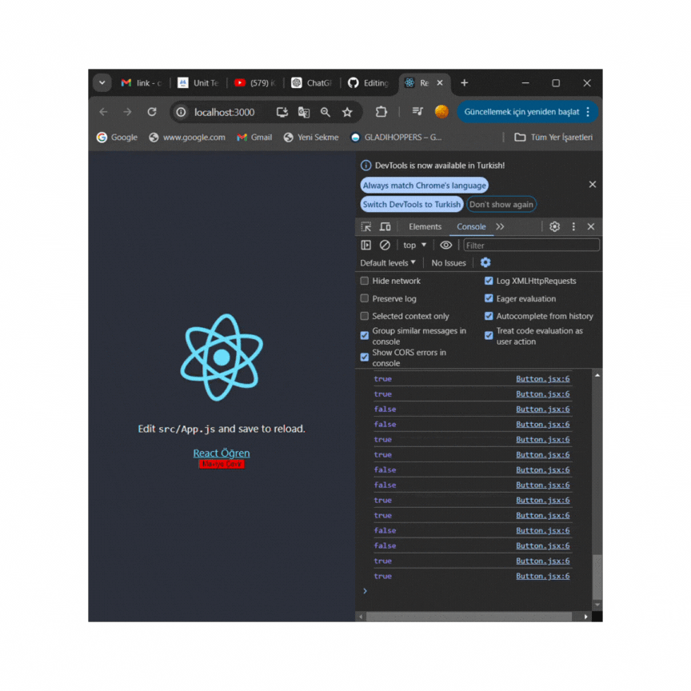

# unit_test

# Expect

- Elementlerin veya verinin beklenen özelliklere sahip olup olmadığını kontrol etmemize yarar.

- Element / veri 'den beklentimizi belirtmemiz için bazı fonksiyonlar sunar: Matchers

# Matchers

- Elementler / diziler / fonksiyonlar üzerinde beklentimizi kontrol eder. Element beklentimze uygunsa testi geçer değilse hata verir.

- https://jestjs.io/docs/using-matchers

- https://github.com/testing-library/jest-dom

# Selector (Seçiciler)

- Render methodu ile sanal ortamda ekran bastığımız bileşenler içerisindeki elemanları test etmek için çağırmamız gerekir. Bu işlemi seçici methodlar ile yaparız.

Bu methodlar js'deki querySelector / getELementById ile aynı işlevi yapar.

https://testing-library.com/docs/queries/byrole

# Roller

- Her html elemanın kendi rolu vardır.

Örn: "a" etiketinin html rolü "link" tir.

- https://developer.mozilla.org/en-US/docs/Web/Accessibility/ARIA/Roles

